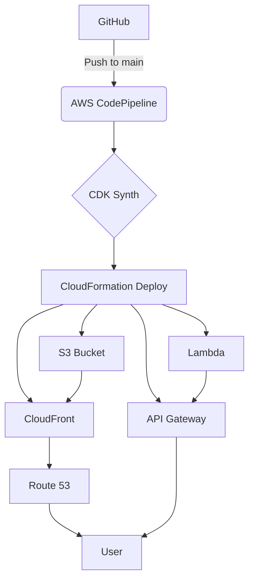

# Python Lambda with CDK and CodePipeline


[View Pipeline in AWS Console](https://console.aws.amazon.com/codesuite/codepipeline/pipelines/MyPipeline/view)

This project demonstrates how to deploy a Python Lambda function using the AWS CDK and a CodePipeline for continuous deployment.

## Prerequisites

* AWS Account and AWS CLI configured
* Node.js and npm installed
* Python 3.9+ installed
* Git installed

## Setup

1. **Clone the repository:**
   ```bash
   git clone <your-repository-url>
   cd <your-repository-name>
   ```

2. **Create a GitHub token:**
   - Go to your GitHub account settings > Developer settings > Personal access tokens.
   - Generate a new token with the `repo` and `workflow` scopes.
   - Store this token in AWS Secrets Manager as a plaintext secret named `github-token`.

   You can create the secret using the AWS CLI with the following command:
   ```bash
   aws secretsmanager create-secret --name github-token --secret-string <your-github-token>
   ```

3. **Update the pipeline configuration:**
   - Open `cdk_pipeline_stack/cdk_pipeline_stack.py`.
   - Replace `"OWNER/REPO"` with your GitHub username and repository name.

4. **Install dependencies:**
   ```bash
   python -m venv .venv
   source .venv/bin/activate
   pip install -r requirements.txt
   ```

## Deployment

1. **Bootstrap your AWS account for CDK:**
   ```bash
   cdk bootstrap
   ```

2. **Deploy the CDK stack:**
   ```bash
   cdk deploy
   ```

This will create the CodePipeline, which will then build and deploy your Lambda function. Any subsequent pushes to the `main` branch will automatically trigger a new deployment.

## Lambda Function

The Lambda function is located in the `lambda` directory. It's a simple function that returns a "Hello from Lambda!" message. The API Gateway endpoint will be created as part of the deployment, and you can find the URL in the AWS CloudFormation console output for the `LambdaStack`.

## Local Testing

You can test the Lambda function locally using the AWS SAM CLI.

1. **Synthesize the CloudFormation template:**
   ```bash
   cdk synth
   ```

2. **Invoke the function locally:**
   ```bash
   sudo sam local invoke HelloHandler -t cdk.out/assembly-CdkPipelineStack-Deploy/CdkPipelineStackDeployLambdaStack85B16C90.template.json
   ```
   *Note: `sudo` may be required to allow SAM to access the Docker daemon.*

## Frontend Deployment

The frontend is a React application built with Vite. The infrastructure for the frontend is defined in `cdk_pipeline_stack/frontend_infra_stack.py`.

The deployment process is as follows:

1.  **S3 Bucket**: An S3 bucket is created to host the static website files.
2.  **CloudFront Distribution**: A CloudFront distribution is set up to serve the content from the S3 bucket. It's configured to use a custom domain (`detectaphish.com`) and an SSL certificate.
3.  **Route 53**: A Route 53 A record is created to point the custom domain to the CloudFront distribution.
4.  **Certificate Manager**: An ACM certificate is created for `detectaphish.com` to enable HTTPS.

### Local Development

To run the frontend locally, navigate to the `frontend` directory and run the following commands:

```bash
npm install
npm run dev
```

This will start a local development server.

## Architecture Diagram



## File and Directory Structure

*   `app.py`: The main entry point for the CDK application.
*   `cdk.json`: Configuration file for the CDK.
*   `cdk_pipeline_stack/`: Contains the CDK stacks for the application.
    *   `cdk_pipeline_stack.py`: Defines the CodePipeline.
    *   `frontend_infra_stack.py`: Defines the infrastructure for the frontend (S3, CloudFront, etc.).
    *   `lambda_stack.py`: Defines the Lambda function and API Gateway.
    *   `pipeline_stage.py`: Defines a stage in the pipeline.
*   `frontend/`: Contains the React frontend application.
*   `lambda/`: Contains the Python Lambda function code.
*   `requirements.txt`: Python dependencies for the CDK application.
